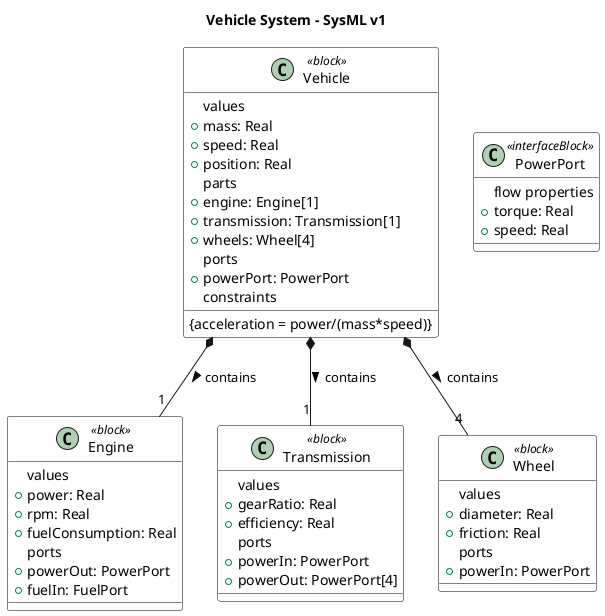
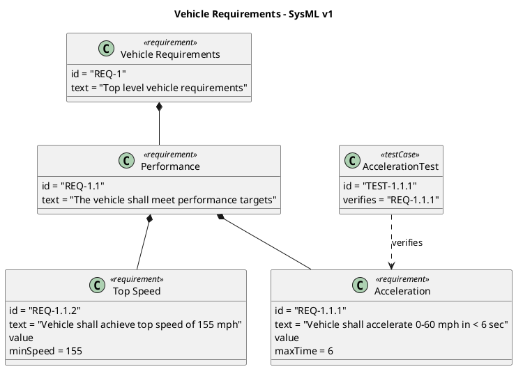
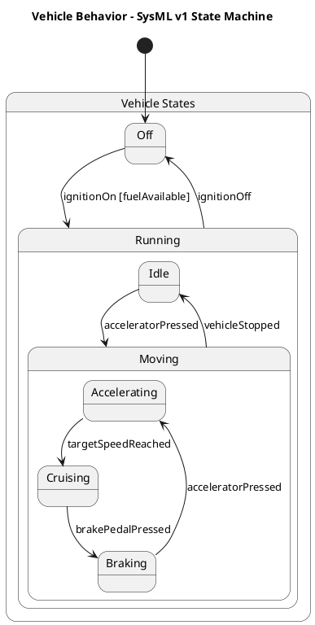

# Comprehensive Comparison: SysML v1 vs SysML v2

## Table of Contents
1. [Fundamental Architecture Changes](#1-fundamental-architecture-changes)
2. [Language Structure and Syntax](#2-language-structure-and-syntax)
3. [Key Modeling Improvements](#3-key-modeling-improvements)
4. [Practical Examples and Comparisons](#4-practical-examples-and-comparisons)
5. [Tool Support and Implementation](#5-tool-support-and-implementation)
6. [Migration Considerations](#6-migration-considerations)

## 1. Fundamental Architecture Changes

### 1.1 Metamodel Evolution
#### SysML v1
- Built as a UML profile
- Inherits UML's software-centric limitations
- Uses MOF (Meta Object Facility) as meta-metamodel
- Heavy reliance on stereotypes for systems concepts

#### SysML v2
- Built on KerML (Kernel Modeling Language)
- Direct systems engineering semantics
- Formal semantic base using First Order Logic
- Clean-sheet design without UML constraints

### 1.2 Language Architecture Components

#### KerML Foundation (SysML v2 Only)
- Core semantic elements
- Feature-based typing system
- Formal constraint language
- Relationship semantics

#### Language Layers
**SysML v1:**
```plaintext
├── UML Base
├── UML Profiles
└── SysML Profile
```

**SysML v2:**
```plaintext
├── KerML Core
├── KerML Foundation
├── SysML Core
└── SysML Libraries
```

## 2. Language Structure and Syntax

### 2.1 Definition and Usage Pattern

#### SysML v1 Approach [vehicle.puml](src/v1/vehicle.puml):
```
class "Vehicle" <<block>> {
    values
        mass: Real
        speed: Real
    parts
        engine: Engine[1]
        transmission: Transmission[1]
        wheels: Wheel[4]
}
```

#### SysML v2 Approach [vehicle.sysml](src/v2/vehicle.sysml):
```
package VehicleSystem {
    part def Vehicle {
        // Definition
        attribute mass : Real;
        attribute speed : Real;
        
        // Parts
        part engine : Engine;
        part transmission : Transmission;
        part wheels : Wheel[4];
        
        // Interfaces
        interface engineTrans connect engine.powerOut to transmission.powerIn;
    }
}
```

### 2.2 Requirements Modeling

#### SysML v1 [requirements.puml](src/v1/requirements.puml):
```
class "Performance" <<requirement>> {
    id = "REQ-1.1"
    text = "The vehicle shall meet performance targets"
}
```

#### SysML v2 [requirements.sysml](src/v2/requirements.sysml):
```
requirement def VehicleRequirements {
    doc /* The vehicle shall meet performance targets */
    
    requirement performance {
        id = "REQ-1.1.1";
        
        require constraint {
            actualTime <= maxTime
        }
        
        verify by AccelerationTest;
    }
}
```

Key Improvements:
1. Formal verification integration
2. Constraint expressions
3. Document generation support
4. Better traceability

### 2.3 Behavioral Modeling

#### State Machines
**SysML v1 [behavior.puml](src/v1/behavior.puml):**
```
state "Vehicle States" as VehicleStates {
    state "Off" as Off
    state "Running" as Running {
        state "Idle" as Idle
        state "Moving" as Moving
    }
}
```

**SysML v2 [behavior.sysml](src/v2/behavior.sysml):**
```
state def VehicleStates {
    entry state off;
    
    state running {
        entry state idle;
        
        state moving {
            state accelerating;
            state cruising;
            
            transition accelerating to cruising when targetSpeedReached;
        }
    }
}
```

## 3. Key Modeling Improvements


## Core Language Features

| Feature | SysML v1 | SysML v2 | Key Differences |
|---------|----------|-----------|-----------------|
| **Foundation** | UML Profile | KerML | v2 built from ground up for systems engineering |
| **Notation** | Graphical only | Graphical + Textual | v2 adds formal textual syntax |
| **Semantics** | UML-based | Formal logic based | v2 has more precise semantic definitions |
| **API** | No standard API | Standard API | v2 enables better tool interoperability |

## Structural Modeling

| Feature | SysML v1 | SysML v2 | Example |
|---------|----------|-----------|----------|
| **Basic Structure** | Blocks | Part Definitions | v1: `class "Vehicle" <<block>>`<br>v2: `part def Vehicle` |
| **Properties** | Value Properties | Attributes | v1: `values mass: Real`<br>v2: `attribute mass : Real;` |
| **Ports** | Flow Ports, Standard Ports | Unified Port Model | v1: `port in power: Real`<br>v2: `port powerIn : ~PowerPort` |
| **Interfaces** | Interface Blocks | Interface Definitions | v1: `class "IF" <<interfaceBlock>>`<br>v2: `interface def PowerIF` |
| **Constraints** | Parametric Diagrams | Integrated Constraints | v1: Separate diagrams<br>v2: `assert constraint {...}` |

## Requirements Engineering

| Feature | SysML v1 | SysML v2 | Example |
|---------|----------|-----------|----------|
| **Requirements** | Requirement Blocks | Requirement Definitions | v1: `<<requirement>>`<br>v2: `requirement def` |
| **Verification** | `<<verify>>` relationship | Verification Cases | v1: `<<verify>>`<br>v2: `verify by TestCase` |
| **Validation** | Not explicit | Built-in Support | v2: `validate by ValidationCase` |
| **Documentation** | Text Property | Doc Clause | v1: `text = "description"`<br>v2: `doc /* description */` |

## Behavioral Modeling

| Feature | SysML v1 | SysML v2 | Example |
|---------|----------|-----------|----------|
| **Actions** | Activity Diagrams | Action Definitions | v1: Activity nodes and edges<br>v2: `action def Process` |
| **States** | State Machines | State Definitions | v1: State diagrams<br>v2: `state def VehicleStates` |
| **Events** | Limited Support | First-class Events | v1: Triggers<br>v2: `event def PowerOn` |
| **Interactions** | Sequence Diagrams | Message Flows | v1: Lifelines and messages<br>v2: Flow-based interactions |

## Model Organization

| Feature | SysML v1 | SysML v2 | Example |
|---------|----------|-----------|----------|
| **Packages** | Basic Packaging | Improved Namespaces | v1: Simple containment<br>v2: Rich namespace management |
| **Views** | Limited Views | View & Viewpoint | v1: Basic diagrams<br>v2: Formal viewpoint framework |
| **Libraries** | Basic Libraries | Improved Libraries | v1: Model libraries<br>v2: Semantic libraries |
| **Variability** | Limited | Improved | v2 adds formal variation points |

## Implementation Features

| Feature | SysML v1 | SysML v2 | Notes |
|---------|----------|-----------|--------|
| **Tool Support** | Widespread | Growing | v1 has mature tools<br>v2 tools emerging |
| **Interoperability** | Tool-specific | Standard API | v2 brings better integration |
| **Model Exchange** | XMI-based | API-based | v2 more reliable exchange |
| **Validation** | Basic | Improved | v2 has formal validation |

## Migration Considerations

| Aspect | SysML v1 | SysML v2 | Migration Impact |
|--------|----------|-----------|------------------|
| **Learning Curve** | Moderate | Steeper | New concepts require training |
| **Tool Migration** | Established | In Progress | Tool vendors adding v2 support |
| **Legacy Models** | Native | Conversion Needed | Migration tools being developed |
| **Team Expertise** | Widespread | Growing | Teams need v2 training |


### 3.1 Structural Modeling

#### Part Definition and Usage
SysML v2 introduces a clear separation:
```sysml
// Definition
part def Engine {
    attribute power : Real;
}

// Usage
part engine : Engine {
    attribute power = 400;
}
```

#### Interface Modeling
**SysML v1:**
- Uses flow ports and standard ports
- Complex proxy port mechanism
- Interface blocks for specifications

**SysML v2:**
```sysml
port def PowerPort {
    attribute torque : Real;
    in item flow power;
}

interface def PowerInterface {
    end engineSide : PowerPort;
    end transSide : ~PowerPort;
}
```

### 3.2 Improved  Type System

#### Units and Quantities
```sysml
attribute def Force : ISQ::ForceValue;
attribute force : Force = 100 [N];
```

#### Constraints and Expressions
```sysml
assert constraint powerCalculation {
    power = torque * angularVelocity
}
```

### 3.3 Model Libraries and Reuse

#### Standard Libraries
- ISQ (International System of Quantities)
- SI Units
- Analysis Functions
- Requirement Types

#### Domain Libraries
- Custom definitions
- Reusable patterns
- Domain-specific extensions

# 4. Practical Examples and Comparisons

## 4.1 Vehicle System Example

### System Structure

#### SysML v1 [vehicle.puml](src/v1/vehicle.puml)


Key Points (v1):
- Uses blocks for component definition
- Flow properties in interface blocks
- Multiplicity shown in composition relationships
- Constraints defined within block compartments

#### SysML v2 [vehicle.sysml](src/v2/vehicle.sysml)
```sysml
package VehicleSystem {
    import ScalarValues::*;
    
    part def Vehicle {
        // Attributes
        attribute mass : Real;
        attribute speed : Real;
        attribute position : Real;
        
        // Parts
        part engine : Engine;
        part transmission : Transmission;
        part wheels : Wheel[4];
        
        // Ports
        port powerPort : PowerPort;
        
        // Constraint
        assert constraint acceleration { 
            acceleration = power/(mass*speed)
        }
        
        // Interface connections
        interface enginePower connect engine.powerOut to transmission.powerIn;
        interface wheelDrive connect transmission.powerOut to wheels.powerIn;
    }
    
    part def Engine {
        attribute power : Real;
        attribute rpm : Real;
        attribute fuelConsumption : Real;
        
        port powerOut : PowerPort;
        port fuelIn : ~FuelPort;  // Conjugated port
    }
    
    part def Transmission {
        attribute gearRatio : Real;
        attribute efficiency : Real;
        
        port powerIn : ~PowerPort;
        port powerOut : PowerPort[4];
    }
    
    part def Wheel {
        attribute diameter : Real;
        attribute friction : Real;
        
        port powerIn : ~PowerPort;
    }
    
    port def PowerPort {
        attribute torque : Real;
        attribute speed : Real;
        
        in item flow power;
    }
}
```

Key Points (v2):
- Uses part definitions instead of blocks
- Direct interface connection syntax
- Conjugated ports using ~ notation
- Explicit import of value types
- More concise port and interface definitions

### Requirements Model

#### SysML v1 [requirements.puml](src/v1/requirements.puml)


#### SysML v2 [requirements.sysml](src/v2/requirements.sysml)
```sysml
package 'Vehicle Requirements' {
    import ScalarValues::*;
    
    requirement def VehicleRequirements {
        doc /* Top level vehicle requirements */
        
        requirement performance {
            doc /* The vehicle shall meet performance targets */
            
            requirement acceleration {
                id = "REQ-1.1.1";
                doc /* Vehicle shall accelerate 0-60 mph in < 6 sec */
                
                attribute maxTime : Real = 6;
                
                require constraint {
                    actualTime <= maxTime
                }
                
                verify by AccelerationTest;
            }
            
            requirement topSpeed {
                id = "REQ-1.1.2";
                doc /* Vehicle shall achieve top speed of 155 mph */
                
                attribute minSpeed : Real = 155;
                
                require constraint {
                    actualSpeed >= minSpeed
                }
            }
        }
    }
    
    case def AccelerationTest {
        subject vehicle : Vehicle;
        
        objective {
            doc /* Verify acceleration requirement */
        }
        
        return verdict : VerdictKind;
    }
}
```

Key Points (v2):
- More formal constraint expressions
- Built-in verification case support
- Documentation using doc keyword
- Explicit subject and objective definitions for test cases

### State Machine

#### SysML v1 [behavior.puml](src/v1/behavior.puml)


#### SysML v2 [behavior.sysml](src/v2/behavior.sysml)
```sysml
package VehicleBehavior {
    state def VehicleStates {
        entry state off;
        
        state running {
            entry state idle;
            
            state moving {
                state accelerating;
                state cruising;
                state braking;
                
                transition accelerating to cruising when targetSpeedReached;
                transition cruising to braking when brakePedalPressed;
                transition braking to accelerating when acceleratorPressed;
            }
            
            transition idle to moving.accelerating when acceleratorPressed;
            transition moving to idle when vehicleStopped;
        }
        
        transition off to running.idle when ignitionOn if fuelAvailable;
        transition running to off when ignitionOff;
        
        // State behaviors
        state action off {
            exit action disengageParking;
        }
        
        state action running {
            entry action startEngine;
            do action monitorSystems;
            exit action shutdownEngine;
        }
        
        // Event definitions
        event ignitionOn;
        event ignitionOff;
        event acceleratorPressed;
        event brakePedalPressed;
        event targetSpeedReached;
        event vehicleStopped;
    }
    
    part vehicle {
        exhibit state vehicleStates : VehicleStates;
    }
}
```

Key Points (v2):
- Explicit entry states
- Formal event definitions
- State actions with entry/do/exit behaviors
- Part exhibits state relationship
- More precise transition syntax

Key Differences Between Versions:
1. Structure:
   - V1: Block-based with stereotypes
   - V2: Part-based with explicit definitions

2. Requirements:
   - V1: Simple requirement blocks with text
   - V2: Formal constraint expressions and verification

3. Behavior:
   - V1: Basic state transitions
   - V2: Rich state behaviors and formal event handling

4. Integration:
   - V1: Separate diagrams with loose connections
   - V2: Integrated model with formal relationships

## 5. Tool Support and Implementation

### 5.1 Available Tools

#### SysML v1
1. Enterprise Architect
2. IBM Rational Rhapsody
3. MagicDraw
4. Papyrus
5. Cameo Systems Modeler

#### SysML v2
1. Official Eclipse Implementation
2. VS Code Extension
3. Commercial Tools (In Development)
   - IBM Rhapsody
   - PTC Windchill
   - Enterprise Architect 16

### 5.2 API and Services

#### Standard API Functions
1. Model Creation
2. Model Query
3. Model Modification
4. Model Analysis
5. Model Export

#### Implementation Example
```typescript
// SysML v2 API Example
const model = new SysMLModel();
const vehicle = model.createPartDefinition("Vehicle");
vehicle.addAttribute("mass", "Real");
```

## 6. Migration Considerations

### 6.1 Migration Strategies

#### Phased Approach
1. Assessment Phase
   - Evaluate existing models
   - Tool readiness check
   - Team training needs

2. Pilot Phase
   - Small project conversion
   - Tool validation
   - Process refinement

3. Full Migration
   - Systematic conversion
   - Parallel modeling where needed
   - Progressive feature adoption

### 6.2 Conversion Patterns

#### Block to Part Definition
```plaintext
SysML v1:
Block Vehicle

SysML v2:
part def Vehicle
```

#### Requirements
```plaintext
SysML v1:
<<requirement>> Performance

SysML v2:
requirement def Performance
```

### 6.3 Common Challenges

1. Tool Migration
   - Version compatibility
   - Data conversion
   - Process adaptation

2. Team Training
   - New concepts
   - Tool familiarity
   - Best practices

3. Process Updates
   - Documentation updates
   - Review procedures
   - Quality assurance

## References

1. Official OMG Documentation
   - SysML v2 Specification
   - SysML v2 API Documentation

2. Implementation Guides
   - Eclipse Pilot Implementation
   - Migration Guidelines

3. Industry Resources
   - Transition Planning Guide
   - Best Practices Documentation
